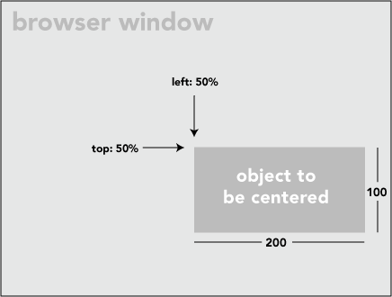
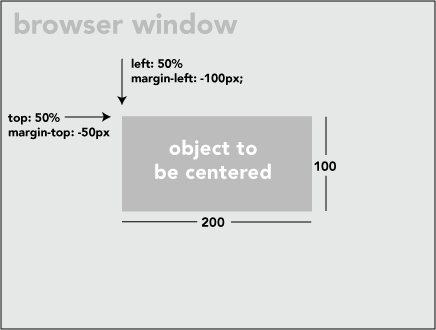

#Vertical Align Middle
[](https://www.facebook.com/ducit "Duc's Homepage")

```
.selector{
   position: relative;
   top: 50%;
   transform: translateY(-50%);
}
```

Anything vertical align middle using only just three line css code. There are many methods for vertical middle, but that all some limitation. For example, if we use text for line-height this work, but only for one line text to sets vertical center. Also one is top 50% and minus half margin of element height, but here element height fixed.
But only three line css code thought set element vertical middle and not need to define element height. Here first set the element position relative so we can set its position thought top and left. Then set top 50% so element position set his parent  height of 50%. Now we only need to minus element half height as defined above minus margin but in margin method we need to define height of the element.
But if set transform to translateY(-50%) it’s auto detect element height and set his position to his half height above actual position. If you say it’s get minus half margin of his height it’s not wrong.


### Extra:
I recently needed to make a placeholder page for a site. I wanted the logo image to be centered exactly in the middle of the screen, that is, both vertically and horizontally centered. Quickly, I thought I'd just give the image element a class of "centered" and then style that class:
```
.centered {
  position: fixed; /* or absolute */
  top: 50%;
  left: 50%;
}
```
But as I'm sure you are thinking, this doesn't quite work. What that accomplishes is putting the upper left corner of image exactly in the center of the page, not the center of the image in the center of the page.



In order to get the image exactly centered, it's a simple matter of applying a negative top margin of half the images height, and a negative left margin of half the images width. For this example, like so:
```
.centered {
  position: fixed;
  top: 50%;
  left: 50%;
  margin-top: -50px;
  margin-left: -100px;
}
```
That will do the trick:



This works wonderfully when you know the size of the thing you are centering. If you don't know, or are thinking it might change and want to be future proof, try this:
```
.centered {
  position: fixed;
  top: 50%;
  left: 50%;
  /* bring your own prefixes */
  transform: translate(-50%, -50%);
}
```
The translate value for transform is based off the size of the element, so that will center nicely.
